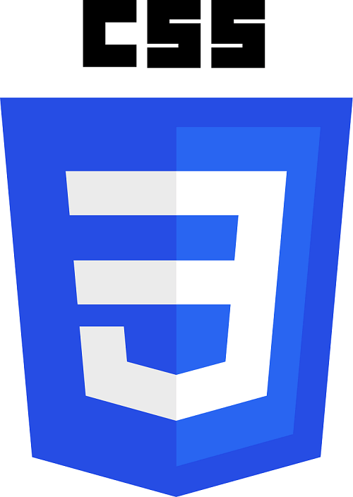
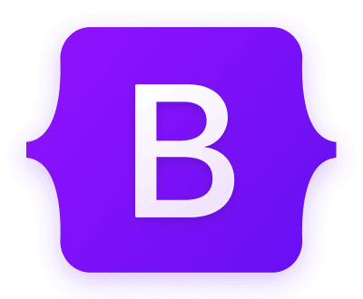

## Technologies
| Picures | Explanation |
|---|---|
|  | Webpage content |
|  | More beautiful webpages |
|  | Weppage logic |

## Cheat Sheets
- Emmet cheat sheet: [Official link](https://drive.google.com/file/d/1CZOgAskeZD0inmB4S3vxtzeiFiqccyDE/view)
- Cheat sheet 2: [Official link](https://coderslink.com/talento/blog/ahorra-tiempo-al-escribir-codigo-html-en-visual-studio-code-utilizando-emmet/)

## Tutorials
- W3 SCHOOLS: [Official link](https://www.w3schools.com/)
- Uniwebsidad: [Official link](https://uniwebsidad.com/)

## Paletton.com
Generate colours: [Generate colours](https://paletton.com/#uid=1000u0kllllaFw0g0qFqFg0w0aF)

## CSS Reference
CSS reference: [Official link](https://lenguajecss.com/css/)

## Responsive web design
Basic principles: [Official link](https://blog.froont.com/9-basic-principles-of-responsive-web-design/)

## What can I use?
Online frontend tool: [Official link](https://caniuse.com/)

## Online validators
- HTML validator: [Official link](https://validator.w3.org/)
- CSS validator: [Official link](https://jigsaw.w3.org/css-validator/)
- JavaScript (JS) validator: [Official link](https://beautifytools.com/javascript-validator.php)

## Official Boostrap website

## Bootstrap's snippets
- Bootsnipp: [Official link](https://www.bootsnipp.com)
- Start bootstrap: [Official link](https://www.startbootstrap.com/snippets)
- Bootdey: [Official link](https://www.bootdey.com)
- Bootstrapious: [Official link](https://www.bootstrapious.com/snippets)

## Official GithHub repositories
- Bootstrap: [Official link](https://github.com/twbs)
- JQuery: [Official link](https://github.com/jquery/jquery)
- Tailwind CSS: [Official link](https://github.com/tailwindlabs/tailwindcss)
- Moment.js: [Official link](https://github.com/moment/moment/)
- Anime.js: [Official link](https://github.com/juliangarnier/anime/)
- Ramda.js: [Official link](https://github.com/ramda/ramda)
- D3.JS: [Official link](https://github.com/d3/d3)
- Chart.js: [Official link](https://github.com/chartjs/Chart.js)
- Math.js: [Official link](https://github.com/josdejong/mathjs)
- Hammer.js: [Official link](https://github.com/hammerjs/hammer.js/tree/master/)
- React: [Official link](https://github.com/facebook/react/
- Redux:  [Official link](https://github.com/reduxjs/redux)
- Glimmer.js: [Official link](https://github.com/glimmerjs/)
- CodeMirror: [Official link](https://github.com/codemirror/dev/)

## Font-awesome
Boostrap CDN: [Official link](https://www.bootstrapcdn.com/fontawesome/)

## How to measure page performance?
PageSpeed Insights: [Official link](https://pagespeed.web.dev/)

## Frotend repositories
- Frontend Checklist: [Official link](https://github.com/thedaviddias/Front-End-Checklist)
- Máster Front End Online Lemoncode: [Official link](https://github.com/Lemoncode/master-frontend-lemoncode)
- Home Assistant Frontend: [Official link](https://github.com/home-assistant/frontend)
- Resources for frontend developers: [Official link](https://github.com/mrcodedev/frontend-developer-resources)
- Frontend Skills: [Official link](https://github.com/FrontendMasters)
- Other frontend repositories: [Official link](https://github.com/topics/frontend)

## How to optimize pictures?
- TinyPNG: [Official link](https://tinypng.com/)
- Compressor.io: [Official link](https://compressor.io/)

## Web application with many utilities
Useful web application: [Official link](https://smalldev.tools/)

## DevDocs Api Documentation
- Home Page: [Official link](https://devdocs.io/)
- HTML Documentation: [Official link](https://devdocs.io/html/)
- CSS Documentation: [Official link](https://devdocs.io/css/)
- JavaScript (JS) Documentatopn: [Official link](https://devdocs.io/javascript/)
- SASS Documentation: [Official link](https://devdocs.io/sass/)
- TypeScript Documentation: [Official link](https://devdocs.io/typescript/)
- JQuery Documentation: [Official link](https://devdocs.io/jquery/)
- Web APIS Documentation: [Official link](https://devdocs.io/dom/)
- Bootstrap 5 Documentation: [Official link](https://devdocs.io/bootstrap~5/)

## CSS Tricks
Tips, tricks and techniques for CSS: [Official link](https://css-tricks.com/)

## Ray.so
Turn your code into beautiful images: [Official link](https://ray.so/)

## Code Formatter
It includes many tools: [Official link](https://codebeautify.org/)

## Showwcase
The Network built for Coders: [Official link](https://www.showwcase.com/)

## Roadmaps
Roadmap.sh is a community effort to create roadmaps, guides and other educational content to help guide the developers in picking up the path and guide their learnings.

[Official link](https://roadmap.sh/)
